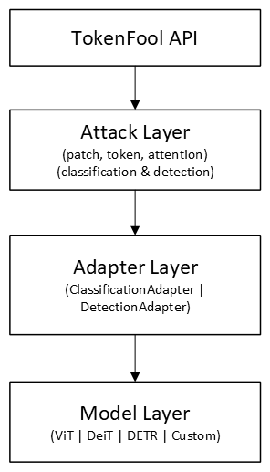

# tokenfool
 
Widely recognized methods for producing adversarial examples (e.g., PGD, FGSM) were developed and popularized in the context of convolutional neural network (CNN)-based image models. These attacks operate in continuous input space and rely on end-to-end differentiability; in practice, they are typically applied as pixel-level perturbations to induce misclassification. Existing open-source adversarial toolkits such as [Foolbox](https://github.com/bethgelab/foolbox), [CleverHans](https://github.com/cleverhans-lab/cleverhans), and [Adversarial Robustness Toolbox (ART)](https://github.com/Trusted-AI/adversarial-robustness-toolbox) consolidate these implementations, enabling users to benchmark robustness and evaluate defenses through standardized interfaces. 

In recent years, transformer-based models have emerged as a dominant alternative to CNNs in computer vision. Architectures such as ViT, DeiT, Swin, and DETR replace convolutional feature extraction with patch tokenization and self-attention mechanisms. These models are now widely deployed across classification, detection, and segmentation tasks. Like CNNs, vision transformers are vulnerable to adversarial examples under standard white-box gradient attacks. However, their token-based representation and global self-attention introduce different structural sensitivities compared to convolutional architectures. In addition to conventional pixel-space perturbations, transformers are susceptible to structured patch-level attacks, token/embedding-space perturbations, and attacks that exploit attention distributions or object query representations in detection models. 

TokenFool is an open-source toolkit that consolidates and standardizes adversarial attack methods targeting image transformers. The toolkit will be modular and extensible, enabling straightforward integration of new attack algorithms. Attacks operate under gradient-based white-box assumptions and integrate directly with standard PyTorch training and evaluation workflows. Support planned for arbitrary PyTorch transformer models via a lightweight adapter interface. Users can integrate custom architectures by implementing a small adapter class that exposes standardized token, attention, and output interfaces. 

### Roadmap

Stage 1: Classification MVP
* Implement 3 selected adversarial attack algorithms:
    * Patch-Fool
    * Adaptive Token Tuning (ATT)
    * Pay No Attention (PNA)
* Design adapter interface and implement for ViT, DeiT
  
Stage 2: Detection transformer support
* Implement adapter for DETR-style transformers
* Add DETR-specific attack implementations





## Development

1. Clone the repository   
(**External contributors**: fork the repository first, then clone your fork)
```bash
git clone https://github.com/TrustThink/tokenfool.git
cd tokenfool
```
2. (Recommended) Create a virtual environment

3. Install the project in editable mode with development dependencies
```bash
pip install -e ".[dev]"
```

4. Run tests
```bash
pytest
```

5. Make changes on a new branch, including tests if necessary

6. Open a Pull Request
